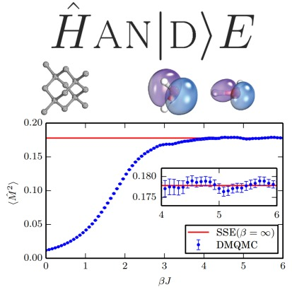
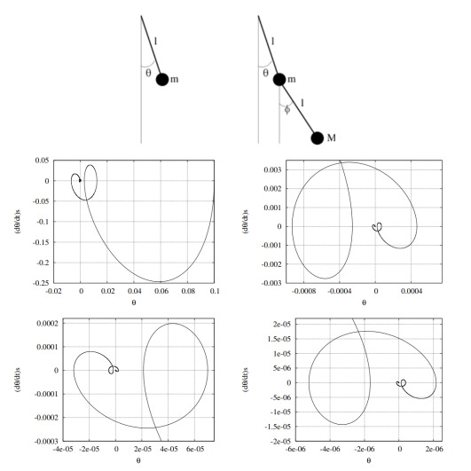

---
# Feel free to add content and custom Front Matter to this file.
# To modify the layout, see https://jekyllrb.com/docs/themes/#overriding-theme-defaults

layout: default
title: "Projects"
abstract: "Selection of Thomas Rogers' projects in machine learning, software engineering, and computational physics."
---

<h2 class="cover-heading">Projects</h2>

Here are some open source projects I have worked on.

<h3 class="cover-heading">Computational Physics</h3>

    

  
  

    <h5 class="card-title">Density Matrix Quantum Monte Carlo</h5>
    <a href="http://www.hande.org.uk/"><i class="fa fa-link" aria-hidden="true"></i></a> &nbsp;
    <a href="https://github.com/hande-qmc/hande"><i class="fa fa-github" aria-hidden="true"></i></a> &nbsp;
    <a href="https://journals.aps.org/prb/abstract/10.1103/PhysRevB.89.245124"><i class="fa fa-file" aria-hidden="true"></i></a> &nbsp;

    <!-- <a href="#" class="btn btn-lg btn-secondary">Project Link</a> -->
  

<h5 class="card-title">Chaotic Dynamics of a Double Pendulum</h5>
<!-- 
Some quick example text to build on the card title and make up the bulk of the card's content.
 -->
<a href="https://github.com/TWRogers/DoublePendulumSimulation"><i class="fa fa-github" aria-hidden="true"></i></a> &nbsp;
<a href="https://github.com/TWRogers/DoublePendulumSimulation/blob/master/pendulum_report/Project_A_Report.pdf"><i class="fa fa-file" aria-hidden="true"></i></a> &nbsp;

<h5 class="card-title">N-body Newtonian Gravity</h5>
<!-- 
Some quick example text to build on the card title and make up the bulk of the card's content.
 -->
<!-- <a href="#" class="btn btn-lg btn-secondary">Project Link</a> -->
<a href="https://github.com/TWRogers/NBodyNewtonianGravity"><i class="fa fa-github" aria-hidden="true"></i></a> &nbsp;
<a href="https://github.com/TWRogers/NBodyNewtonianGravity/blob/master/gravity_report/gravity.pdf"><i class="fa fa-file" aria-hidden="true"></i></a> &nbsp;

<h2 class="cover-heading">Publications</h2>

Here are some some publications.



